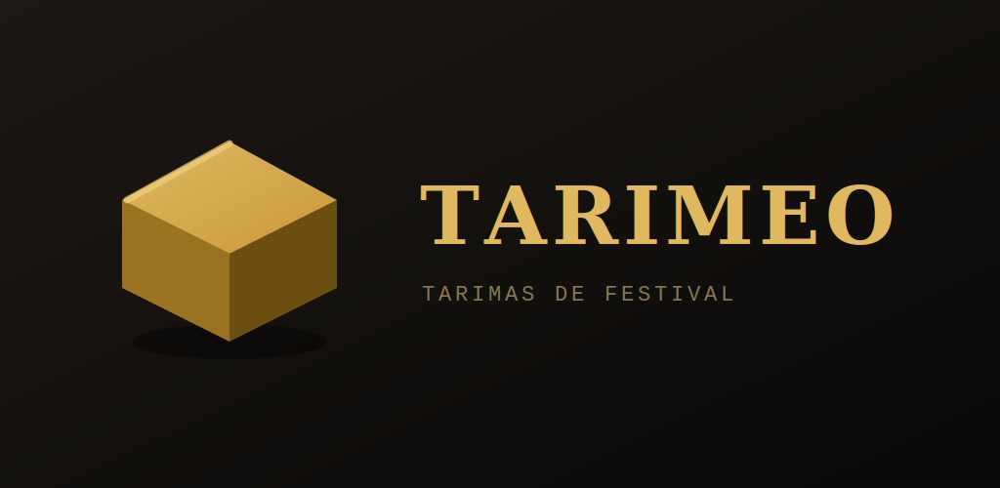

<div align="center">



# Tarimeo

<a href="#español">🇪🇸 Español</a> · <a href="#english">🇬🇧 English</a>

</div>

---

<a name="español"></a>

<div align="center">

**Diseña y organiza la distribución de tarimas y escenarios de tu festival.**

Una herramienta visual, rápida y sin complicaciones para planificar el montaje de tarimas modulares por días y escenarios. Funciona sin conexión.

[](https://javitatay.github.io/Tarimeo/)
[](https://javitatay.github.io/Tarimeo/)
[-141210?style=for-the-badge)](https://github.com/javitatay/Tarimeo/releases/latest)

</div>

## ¿Qué es Tarimeo?

Tarimeo te ayuda a planificar dónde va cada tarima sobre el plano de un escenario, organizar el montaje por días y por escenarios, controlar cuántos módulos tienes disponibles y compartir el plano con tu equipo en segundos. Todo se guarda en tu dispositivo: **no necesita internet ni crear ninguna cuenta**.

### Funciones principales

- 🎪 **Plano por escenarios** — coloca los bloques sobre una cuadrícula arrastrándolos con el dedo o el ratón.
- 📅 **Varios días** — planifica cada jornada del evento de forma independiente.
- 🎸 **Asignación a artistas** — visualiza de un vistazo quién ocupa qué, con código de color.
- 📦 **Control de stock** — sabe en todo momento cuántos módulos usas y cuántos te quedan.
- 🖨️ **Exporta y comparte** — genera planos para imprimir o PDF, exporta a CSV, guarda imágenes y crea copias de seguridad.
- 🔍 **Buscador visual** — filtra bloques y artistas en tiempo real; el resto del plano se atenúa para que solo veas lo que buscas.
- ↩️ **Deshacer y rehacer** — historial de hasta 30 pasos (Ctrl+Z / Ctrl+Y).
- 🪜 **Extras de seguridad** — marca faldón, ruedas, escalera y barandilla por bloque. A partir de 60 cm de altura, la app sugiere escalera y barandilla automáticamente según normativa.
- 📱 **Optimizado para móvil** — pan táctil y zoom con pellizco sobre el plano sin interferir con el dibujo de bloques.
- 🌙 **Modo claro y oscuro** y **bilingüe** (español / inglés).
- 📴 **Funciona sin conexión**, ideal para usar durante el montaje en el recinto.

---

## 📲 Cómo instalar Tarimeo (recomendado)

La forma más sencilla y con mejor experiencia es instalarla directamente desde el navegador. Se ve **a pantalla completa, como una app normal**, y se actualiza sola.

**En Android (Chrome):**
1. Abre **[javitatay.github.io/Tarimeo](https://javitatay.github.io/Tarimeo/)** en Chrome.
2. Toca el menú de los tres puntos (arriba a la derecha).
3. Pulsa **"Añadir a pantalla de inicio"** (o "Instalar aplicación").
4. Confirma. El icono de Tarimeo aparecerá entre tus apps.

**En iPhone / iPad (Safari):**
1. Abre **[javitatay.github.io/Tarimeo](https://javitatay.github.io/Tarimeo/)** en Safari.
2. Toca el botón de **compartir** (el cuadrado con la flecha).
3. Pulsa **"Añadir a pantalla de inicio"**.

Al abrirla desde el icono funciona como una app: pantalla completa, sin barra de navegador y disponible sin conexión.

---

## ⬇️ Alternativa: instalar el APK (Android)

Si prefieres un archivo instalable, también hay un APK disponible:

1. Ve a la sección **[Releases](https://github.com/javitatay/Tarimeo/releases/latest)** y descarga **`Tarimeo.apk`** en tu móvil.
2. Ábrelo. Android avisará de que procede de un "origen desconocido": es normal en apps que no vienen de Google Play. Concede el permiso para instalar.
3. Tarimeo aparecerá en tu lista de apps.

> Nota: instalado por esta vía, es posible que la app muestre una pequeña barra de navegador en la parte superior. Si prefieres la experiencia a pantalla completa, usa el método recomendado de arriba (instalar desde el navegador).

---

## 💾 Tus datos

Toda la información que introduces (festivales, artistas, bloques, distribuciones) se guarda **únicamente en tu dispositivo**. No se envía a ningún servidor ni se comparte con nadie. Si cambias de móvil o quieres llevarte los datos, usa la opción de **copia de seguridad** dentro de la app para exportar e importar un archivo.

---

## 🛠️ Para desarrolladores

Tarimeo es una aplicación web autocontenida en un único archivo `index.html`, sin dependencias externas ni framework. Se sirve como [PWA](https://web.dev/progressive-web-apps/) mediante GitHub Pages y se empaqueta para Android con [PWABuilder](https://www.pwabuilder.com/).

```
index.html              · toda la app (estructura, estilos y lógica)
manifest.webmanifest    · metadatos de la PWA
sw.js                   · service worker (instalable + offline)
icons/                  · iconos de la app
```

Para probarlo en local basta con servir la carpeta con cualquier servidor estático, por ejemplo:

```bash
python3 -m http.server 8080
# y abrir http://localhost:8080
```

---

## 📄 Licencia

Tarimeo se distribuye bajo la licencia **[GNU General Public License v3.0](LICENSE)**.

Eres libre de usar, estudiar, modificar y compartir este software. La única condición importante es que, si distribuyes una versión modificada, debe mantenerse también como código abierto bajo esta misma licencia, para que las mejoras sigan estando disponibles para todos.

[](LICENSE)

---

<div align="center">
<sub>Hecho para producción de eventos · Tarimeo</sub>
</div>

<br><br>

---
---

<a name="english"></a>

<div align="center">

**Design and organise your festival's stage riser layout.**

A visual, fast and straightforward tool for planning modular stage riser placement by day and stage. Works offline.

[](https://javitatay.github.io/Tarimeo/)
[](https://javitatay.github.io/Tarimeo/)
[-141210?style=for-the-badge)](https://github.com/javitatay/Tarimeo/releases/latest)

</div>

## What is Tarimeo?

Tarimeo helps you plan where each riser goes on a stage floor plan, organise the setup by days and stages, track how many modules you have available, and share the layout with your crew in seconds. Everything is saved on your device: **no internet connection or account required**.

### Key features

- 🎪 **Stage floor plan** — place blocks on a grid by dragging with your finger or mouse.
- 📅 **Multiple days** — plan each day of the event independently.
- 🎸 **Artist assignment** — see at a glance who occupies what, with colour coding.
- 📦 **Stock control** — always know how many modules you are using and how many remain.
- 🖨️ **Export and share** — generate printable/PDF layouts, export to CSV, save images and create backups.
- 🔍 **Visual search** — filter blocks and artists in real time; everything else dims so you only see what you need.
- ↩️ **Undo and redo** — up to 30-step history (Ctrl+Z / Ctrl+Y).
- 🪜 **Safety extras** — mark skirting, wheels, stairs and railing per block. Above 60 cm height, the app automatically suggests stairs and railing per safety regulations.
- 📱 **Mobile optimised** — touch pan and pinch-to-zoom on the floor plan without interfering with block drawing.
- 🌙 **Light and dark mode**, **bilingual** (Spanish / English).
- 📴 **Works offline**, ideal for use during load-in at the venue.

---

## 📲 How to install Tarimeo (recommended)

The easiest way with the best experience is to install it directly from your browser. It runs **full screen, just like a native app**, and updates itself automatically.

**On Android (Chrome):**
1. Open **[javitatay.github.io/Tarimeo](https://javitatay.github.io/Tarimeo/)** in Chrome.
2. Tap the three-dot menu (top right).
3. Tap **"Add to Home screen"** (or "Install app").
4. Confirm. The Tarimeo icon will appear among your apps.

**On iPhone / iPad (Safari):**
1. Open **[javitatay.github.io/Tarimeo](https://javitatay.github.io/Tarimeo/)** in Safari.
2. Tap the **share** button (the square with an arrow).
3. Tap **"Add to Home Screen"**.

Once opened from the icon it works like an app: full screen, no browser bar, and available offline.

---

## ⬇️ Alternative: install the APK (Android)

If you prefer an installable file, an APK is also available:

1. Go to the **[Releases](https://github.com/javitatay/Tarimeo/releases/latest)** section and download **`Tarimeo.apk`** to your phone.
2. Open it. Android will warn that it comes from an "unknown source" — this is normal for apps not distributed through Google Play. Grant the permission to install.
3. Tarimeo will appear in your app list.

> Note: installed this way, the app may show a small browser bar at the top. For a full-screen experience, use the recommended method above (install from the browser).

---

## 💾 Your data

All the information you enter (festivals, artists, blocks, layouts) is saved **only on your device**. Nothing is sent to any server or shared with anyone. If you change devices or want to move your data, use the **backup** option inside the app to export and import a file.

---

## 🛠️ For developers

Tarimeo is a self-contained web application in a single `index.html` file, with no external dependencies or framework. It is served as a [PWA](https://web.dev/progressive-web-apps/) via GitHub Pages and packaged for Android with [PWABuilder](https://www.pwabuilder.com/).

```
index.html              · the full app (structure, styles and logic)
manifest.webmanifest    · PWA metadata
sw.js                   · service worker (installable + offline)
icons/                  · app icons
```

To run it locally, serve the folder with any static server, for example:

```bash
python3 -m http.server 8080
# then open http://localhost:8080
```

---

## 📄 Licence

Tarimeo is distributed under the **[GNU General Public License v3.0](LICENSE)**.

You are free to use, study, modify and share this software. The one important condition is that if you distribute a modified version, it must remain open source under this same licence, so that improvements stay available to everyone.

[](LICENSE)

---

<div align="center">
<sub>Built for live event production · Tarimeo</sub>
</div>
